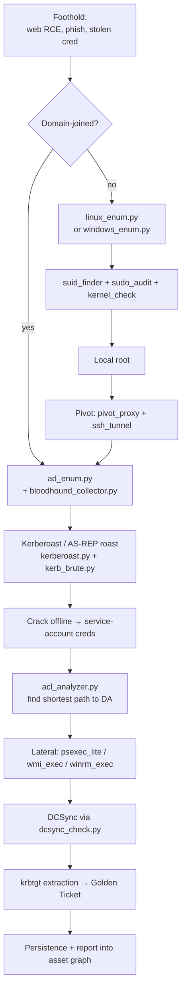

# Part 5 · Network & Infrastructure Security

You've mastered the perimeter (Part 3 recon, Part 4 web). Now we step **inside the wire** — the part of the engagement where you have a foothold and need to expand it: a pivot host, a stolen NTLM hash, a low-privilege shell on a Linux box, a service account in Active Directory.

This is where a US government clearance role separates two career tracks: the *application pentester* who finds bugs and reports them, and the *red team operator* who chains a single bug into domain admin and exfiltrates classified data. Part 5 prepares you for the second.

## Why this material matters

The 2020 SolarWinds Orion compromise, the 2021 Colonial Pipeline ransomware event, and almost every nation-state intrusion (APT29, APT41, Lazarus, Volt Typhoon) follow the same playbook: **initial access → AD enumeration → credential harvest → Kerberos abuse → lateral movement → DCSync → exfiltration**. If you can reproduce that chain in a lab, you can defend against it on a SOC, model it for purple teaming, and explain it during a TS/SCI interview.

| Industry | Internal-network risks you'll be hired to test | Real-world precedent |
|---|---|---|
| **Defense / IC** | Cleared-network compromise, AD trust abuse across forests, Kerberos golden-ticket persistence | Multiple SolarWinds-class incidents; the 2020 NSA AD security advisory |
| **Critical infrastructure / ICS** | Pivot from corporate AD into OT segment, RDP/SMB lateral movement to engineering workstations | Colonial Pipeline 2021 (DarkSide), Ukraine 2015 (Sandworm) |
| **Financial services** | Domain admin → core banking, Kerberoasting service accounts on internal apps | Carbanak (2014-onward); SWIFT-related incidents |
| **Healthcare** | Ransomware kill chains beginning at AD; medical device segmentation bypasses | Conti, Ryuk, BlackCat — all AD-pivoting families |
| **Cloud / hybrid** | Hybrid AD → Azure AD synced credential abuse, AAD Connect DC sync | NOBELIUM 2021, Microsoft DART case studies |

## Modules

| # | Module | Focus |
|---|---|---|
| **18** | [Active Directory Attacks](18-active-directory.md) | LDAP enumeration, Kerberos (AS-REP roast, Kerberoast, Silver/Golden Tickets), DCSync, ACL abuse, BloodHound-style attack-path analysis |
| **19** | [Network Pivoting & Lateral Movement](19-pivoting-lateral.md) | SOCKS proxies, SSH tunnels, port forwarding, PsExec/WMI/WinRM execution, DNS tunneling, living-off-the-land |
| **20** | [Linux Privilege Escalation](20-linux-privesc.md) | Linux enumeration playbook, SUID/SGID + GTFOBins, sudo abuse, kernel exploits, cron, capabilities, container escapes |
| **21** | [Windows Privilege Escalation](21-windows-privesc.md) | Windows enumeration, service abuse, token privileges (SeImpersonate, SeDebug), UAC bypass, DPAPI, NTLM relay |

## Learning outcomes

By the end of Part 5 you can:

- **Enumerate** a Windows domain from an unauthenticated foothold all the way through to mapped attack paths (users, groups, ACLs, SPNs, trusts).
- **Crack Kerberos** the way modern operators do: AS-REP roast unauth, Kerberoast service accounts, request Silver/Golden Tickets, and explain Kerberos relay (CVE-2022-33679, CVE-2024-21427) wire-level.
- **Move laterally** with PsExec, WMI, WinRM, RDP, and SSH — and pivot through a compromised host with SOCKS or DNS tunnels when no direct route exists.
- **Privilege-escalate on Linux** through SUID/sudo/cron/capabilities/kernel and explain container/namespace escapes.
- **Privilege-escalate on Windows** through services, tokens, UAC, DPAPI, AlwaysInstallElevated, and shadow copy abuse — the classic SeImpersonate→SYSTEM dance.
- **Operate stealthily** — disable host telemetry, use signed binaries, prefer protocol-native attacks (Kerberos > Mimikatz, WMI > psexec).
- **Hand off** every finding into the asset graph (Part 3) and report generator so a blue team can replay the attack chain.

## Prerequisites

You should be comfortable with:
- LDAP / SMB / Kerberos protocols at packet level (Part 2 protocols module)
- TLS handshake, NTLM authentication negotiation (Part 2 crypto module)
- Network mapping, asset graph, OSINT pipeline (Part 3)
- Web-tier authentication (OAuth, SAML, JWT) — many AD environments are hybrid (Part 4)

A working **lab** is non-negotiable. Recommended:
- One Windows Server 2022 DC (`labdc.lab.local`)
- Two Windows 10/11 domain-joined workstations (`ws01`, `ws02`)
- One Linux pivot box (`ubuntu-pivot`)
- One isolated VLAN, no production routing
- See [Part 1 Module 03 lab setup](../part-01-foundations/03-lab-setup.md) for the build script

Free alternatives:
- **GOAD** (Game Of Active Directory) — full vulnerable AD lab, Vagrant-based
- **HTB Pro Labs** (Dante, Offshore, RastaLabs) — for paid practice
- **TryHackMe** AttackBox + Kerberos rooms — for walkthroughs

## Toolkit additions in this part

`redshift_toolkit/` grows by ~25 modules across three subpackages:

```
redshift_toolkit/
├── ad/                          # NEW — Active Directory attack toolkit
│   ├── ad_enum.py               # LDAP enumeration (users/groups/SPNs/trusts)
│   ├── kerb_brute.py            # username enum + AS-REP roasting
│   ├── kerberoast.py            # request TGS for service accounts
│   ├── dcsync_check.py          # DCSync rights + simulated replication
│   ├── bloodhound_collector.py  # SharpHound-style LDAP collector (pure Python)
│   ├── acl_analyzer.py          # DACL parsing for attack paths
│   └── password_spray.py        # safe spraying (lockout-aware)
├── postex/                      # NEW — Post-exploitation toolkit
│   ├── pivot_proxy.py           # SOCKS5 proxy via compromised host
│   ├── ssh_tunnel.py            # SSH local/remote/dynamic forward
│   ├── port_forwarder.py        # generic TCP forwarder
│   ├── psexec_lite.py           # SMB-service execution (NT AUTHORITY\\SYSTEM)
│   ├── wmi_exec.py              # WMI command execution
│   ├── winrm_exec.py            # WinRM execution
│   ├── dns_tunnel.py            # DNS covert channel client
│   ├── linux_enum.py            # full Linux post-ex enumeration
│   ├── suid_finder.py           # SUID + GTFOBins matcher
│   ├── sudo_audit.py            # sudo rule analysis
│   ├── linux_kernel_check.py    # CVE matcher for `uname -r`
│   ├── windows_enum.py          # full Windows post-ex enumeration
│   ├── service_audit.py         # service ACL + unquoted path scanner
│   └── token_inspector.py       # token privilege analysis (SeImpersonate, SeDebug…)
└── creds/                       # NEW — Credential operations
    ├── ntlm_relay_coord.py      # NTLM relay coordinator (signaling)
    ├── secretsdump_lite.py      # SAM/SECURITY/SYSTEM hive parser
    └── dpapi_decryptor.py       # DPAPI master-key + blob decryption
```

## Engagement workflow



## Ethics & legal

Every script in Part 5 has the capacity to take down a domain controller, lock out every user, or trigger an EDR lateral-movement alert. **None of this is legal outside an authorized lab or scoped engagement.**

Before running any module 18-21 tool against a live target:

1. **Written authorization** with explicit scope (subnets, hostnames, allowed time windows).
2. **Lockout coordination** — coordinate with AD admins. `password_spray.py` defaults to 1-attempt-per-30-minutes and reads the domain lockout policy first.
3. **Change advisory** — DCSync, NTLM relay, and Kerberoast all generate event-log signal (4624/4625/4769/4776). Brief the SOC.
4. **Rollback plan** — if you get domain admin, document everything and *do not* persist beyond authorization (no Golden Tickets in production, period).

The Federal Computer Fraud and Abuse Act (18 USC §1030), the Computer Misuse Act 1990 (UK), and equivalent laws elsewhere all apply. A signed Rules of Engagement document is your only legal cover.

## How Part 5 connects to the rest of the curriculum

- **Inputs from Part 3** — the asset graph already contains hostnames, OS guesses, open SMB/LDAP/Kerberos ports.
- **Inputs from Part 4** — captured cookies/tokens/SAML assertions can become initial-access credentials.
- **Outputs to Part 6** — system-level exploitation (Module 22-26) consumes Part 5's privesc results.
- **Outputs to Part 7** — persistence (Module 27-30) consumes domain-admin status.
- **Outputs to Part 13 (Blue Team)** — every Part 5 attack has a corresponding detection rule (Sigma, Splunk SPL, Microsoft Defender XDR query).

Let's get inside.
