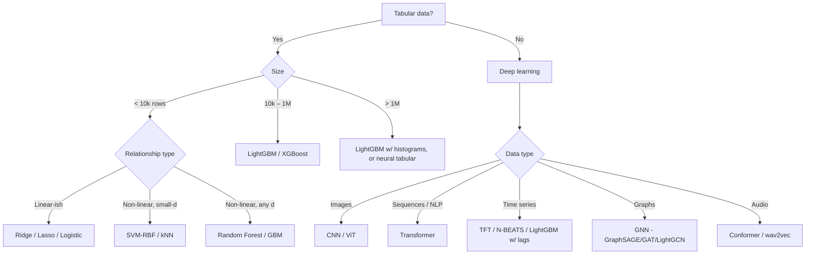

# 📋 Rapid Revision

!!! abstract "How to use this page"
    This is your **morning-of** cheat sheet. Skim the decision tree, memorize the phrases that earn points, scan the formula table. Do not read this as a first pass — read the other modules first, then use this for priming.

---

## 🧭 Algorithm decision tree

---

## ⚡ The 20 most-asked interview facts

| # | Topic | Key fact |
|---|---|---|
| 1 | **Ridge vs Lasso** | L2 shrinks smoothly; L1 zeros coefficients (corners of the diamond) |
| 2 | **Bias-variance** | Total error = bias² + variance + irreducible noise |
| 3 | **Logistic regression** | Linear model + sigmoid + cross-entropy loss; no closed form → IRLS / SGD |
| 4 | **Decision tree splits** | Gini, entropy (classification), MSE/MAE (regression) |
| 5 | **Random Forest** | Bagging + random feature subsampling; reduces variance, not bias |
| 6 | **Gradient Boosting** | Each tree fits negative gradient of loss w.r.t. prediction |
| 7 | **XGBoost** | GBM + 2nd-order Taylor + regularization + histogram splits + sparsity-aware |
| 8 | **LightGBM** | Leaf-wise growth + GOSS (gradient-based sampling) + EFB (exclusive feature bundling) |
| 9 | **CatBoost** | Ordered boosting fixes target leakage; native categorical handling |
| 10 | **SVM** | Maximize margin; dual form uses inner products → kernel trick |
| 11 | **K-means** | Minimize within-cluster SSE; EM-style alternation; non-convex; K-means++ init |
| 12 | **DBSCAN** | Density-based; core points, border points, noise; finds k automatically |
| 13 | **PCA** | Eigen-decompose covariance matrix; top-k eigenvectors = principal components |
| 14 | **t-SNE vs UMAP** | Both nonlinear; t-SNE local-only; UMAP faster, preserves global structure |
| 15 | **Naive Bayes** | Assumes feature independence given class; works anyway for text due to rank-preservation |
| 16 | **ARIMA** | AR(p) + I(d) differencing + MA(q); use ADF for $d$, ACF/PACF for $p, q$ |
| 17 | **MF for recsys** | $R \approx UV^T$; solve via ALS (closed-form per row) or SGD |
| 18 | **Two-tower** | User + item towers → dot product; offline-indexable, ANN-retrievable |
| 19 | **Isolation Forest** | Anomalies isolated with shorter path length; $O(n \log n)$ |
| 20 | **Calibration** | Platt (sigmoid) or isotonic; Brier score measures calibration |

---

## 🧮 Formulas to know cold

### Linear & logistic regression
$$\text{OLS: } \hat\beta = (X^T X)^{-1} X^T y$$
$$\text{Ridge: } \hat\beta = (X^T X + \lambda I)^{-1} X^T y$$
$$\text{Log loss: } L = -\frac{1}{n}\sum_i [y_i \log \hat p_i + (1-y_i)\log(1 - \hat p_i)]$$
$$P(y=1 \mid x) = \sigma(\beta^T x) = \frac{1}{1 + e^{-\beta^T x}}$$

### Tree impurity
$$\text{Gini: } G = 1 - \sum_c p_c^2$$
$$\text{Entropy: } H = -\sum_c p_c \log_2 p_c$$
$$\text{Info gain: } \text{IG} = H(\text{parent}) - \sum_{\text{children}} \frac{n_c}{n} H(\text{child})$$

### Gradient boosting 2nd-order
$$\text{Split gain } = \frac{1}{2}\left[ \frac{G_L^2}{H_L + \lambda} + \frac{G_R^2}{H_R + \lambda} - \frac{(G_L + G_R)^2}{H_L + H_R + \lambda}\right] - \gamma$$

### SVM primal
$$\min_{w, b, \xi} \frac{1}{2}\|w\|^2 + C\sum_i \xi_i \quad \text{s.t. } y_i(w^T x_i + b) \geq 1 - \xi_i, \xi_i \geq 0$$

### K-means objective
$$\min_{\{\mu_k\}, \{z_i\}} \sum_i \|x_i - \mu_{z_i}\|^2$$

### PCA eigenvalue problem
$$\Sigma v = \lambda v, \quad \Sigma = \frac{1}{n-1}X^T X \text{ (centered)}$$

### Probability / Bayes
$$P(y \mid x) = \frac{P(x \mid y) P(y)}{P(x)} \propto P(x \mid y) P(y)$$

### Time series & stationarity
$$\nabla y_t = y_t - y_{t-1}$$
$$\text{ARIMA(p,d,q): } \phi(B)(1-B)^d y_t = \theta(B) \epsilon_t$$

### Matrix factorization
$$\min_{U,V} \sum_{(i,j) \in \Omega} (r_{ij} - u_i \cdot v_j)^2 + \lambda (\|U\|^2 + \|V\|^2)$$

### NDCG
$$\text{DCG}@K = \sum_{i=1}^K \frac{2^{\text{rel}_i} - 1}{\log_2(i+1)}$$

### Thompson sampling (Beta-Bernoulli)
$$\text{sample } \theta_a \sim \text{Beta}(\alpha_a, \beta_a), \quad \text{pick } \arg\max_a \theta_a$$

---

## 🗣️ Phrases that earn points

Use these verbatim when they fit — they are shibboleths that tell the interviewer you've been here before.

### Linear models
- "The L1 ball has **corners on the axes**, which is why the optimum often lands at a corner and coordinates become exactly zero."
- "Ridge has a **closed-form** solution, Lasso doesn't — it requires coordinate descent or LARS."
- "Elastic Net combines L1 and L2 to handle **groups of correlated features**."

### Trees
- "XGBoost's split score uses the **second-order Taylor expansion** — gradient and Hessian."
- "LightGBM grows **leaf-wise by max delta loss**, not level-wise."
- "Random Forest reduces **variance**; boosting reduces **bias**. That's why RF does bagging and GBM does additive fitting."

### SVM
- "By the **representer theorem**, the optimal $w$ is a linear combination of support vectors in feature space."
- "The **kernel trick** replaces inner products without computing the feature map explicitly."
- "**RBF corresponds to an infinite-dimensional feature space** via the Taylor expansion of the exponential."

### Clustering
- "K-means is **Lloyd's algorithm** — coordinate descent on the SSE objective — so it monotonically decreases and converges, but only to a **local minimum**."
- "**DBSCAN density-reachability is not symmetric** between core and border points."
- "**K-means++** seeding gives a $O(\log k)$ expected approximation to the optimum."

### Probabilistic
- "Naive Bayes works despite violating its assumption because the class posterior depends on **rank ordering**, not absolute probability values."
- "The **curse of dimensionality** makes distance lose meaning — in high-d, nearest and farthest point distances concentrate."

### Time series
- "ADF tests **unit root** — small p-value means stationary. KPSS tests stationarity directly — small p-value means **non**-stationary. Run both."
- "Time series CV must use **expanding or rolling window** — random k-fold leaks the future."

### Recommenders
- "Modern production recsys is a **retrieval-ranking-rerank** pipeline."
- "Two-tower is preferred for retrieval because **item embeddings can be precomputed** and ANN-indexed."
- "**Offline NDCG improvements don't always translate to online CTR** because of position bias and novelty fatigue."

### Anomaly detection
- "**Isolation Forest** is efficient because anomalies are **isolated in fewer splits** than normal points."
- "**LOF** detects local anomalies — a sparse point in an otherwise dense neighborhood — which Isolation Forest can miss."

### Bayesian / Optimization
- "**Conjugate priors** make posterior updates closed-form — e.g., Beta-Bernoulli, Gamma-Poisson, Normal-Normal."
- "**EM guarantees monotonic increase** in likelihood, but not convergence to the global optimum."

---

## 🛑 Phrases that lose points

Avoid these — they signal shallow understanding and interviewers will drill deeper to expose it.

| Bad phrase | Why it's bad | Better |
|---|---|---|
| "L1 selects features because gradients are zero" | Confused — L1 has no gradient at zero | "L1 ball corners force solutions onto axes" |
| "XGBoost is just gradient boosting" | Misses the 2nd-order + regularization + system work | "XGBoost is GBM with 2nd-order Taylor, structural regularization, and histogram-based splitting" |
| "Random Forest overfits less than a single tree" | Vague — why? | "Bagging + feature subsampling reduce variance of correlated trees" |
| "SVMs are state of the art" | Not true since ~2014 for most domains | "SVM with RBF is a strong small-data baseline, but rarely beats XGBoost on tabular or deep models on images/text" |
| "K-means works for any data" | No — assumes spherical equal-size clusters | "K-means works when clusters are roughly convex and equi-sized" |
| "t-SNE shows cluster distances accurately" | Dangerous — inter-cluster distance in t-SNE is **not meaningful** | "t-SNE preserves local neighborhood; don't read inter-cluster distances off it" |
| "Just train more to fix overfitting" | Wrong direction | "Overfitting needs regularization, more data, or less model capacity" |
| "I'd use AUC because it's a good metric" | Lazy — metric choice depends on cost structure | "AUC ranks well but can hide calibration issues; I'd also check Brier score and precision@k" |
| "Deep learning is always better" | False for most tabular and small-data problems | "Deep learning wins on unstructured data at scale; for tabular, GBDTs usually dominate" |

---

## 🧾 30-second answers for hot takes

**Q: "Why not always use deep learning?"**
Deep learning needs lots of labeled data, wins on unstructured inputs (images/text/audio), but on small tabular problems GBDTs beat deep models while being faster, more interpretable, and requiring less GPU.

**Q: "Is ARIMA dead in 2026?"**
No. It's unnecessary for large-scale forecasting (LightGBM wins), but it remains the interpretable, low-data standard — and a strong baseline that new methods must beat.

**Q: "Do you really need to know all these classical algorithms?"**
Yes. They teach the core intuitions (bias/variance, kernel trick, EM, regularization, dual formulations) that you'll use to reason about modern deep models. Modern systems are built from classical pieces: embeddings + ANN + trees + Bayesian priors.

**Q: "When should I pick precision vs recall?"**
Precision when false positives are costly (spam → marking real emails as spam). Recall when false negatives are costly (cancer screening → missing a real case). When in doubt, report both and show the PR curve.

**Q: "What's the single most common ML project failure mode?"**
Data leakage — some column in training contains information not available at inference time. Detected by suspiciously good validation performance and bad production performance. Always audit feature lineage before trusting a metric.

---

## ✅ Exam-day mental sequence

1. **Listen, clarify, restate the problem** (never jump to algorithm)
2. **State the data properties** that drive your choice (size, dimension, label density, structure)
3. **Pick a baseline + a candidate model** — never propose just one
4. **Metric + validation scheme** (tied to business cost)
5. **Evaluate** → interpret error modes → iterate
6. **Mention production concerns**: latency, retraining, monitoring, drift, fairness

If you do these six things every time, you'll pass 90% of senior ML algorithm interviews even when you don't know the exact model they had in mind.

→ Back to [🏠 Home](index.md)
