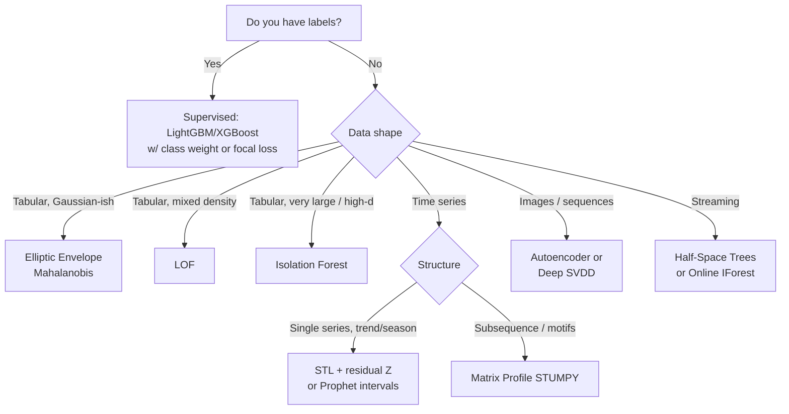

# 🛒 Recommenders & Specialty Algorithms

!!! abstract "Module Scope"
    Recommender systems (content-based → CF → matrix factorization → two-tower → graph-based) and **specialty anomaly-detection algorithms** not covered elsewhere. Questions **Q101–Q115**. Recommender questions are frequent for e-commerce, streaming, social, ad-tech interviews — come prepared with evaluation nuance (offline ≠ online) and cold-start strategies.

---

## Q101. Content-based vs collaborative filtering — the fundamental tradeoff { #q101 }

<span class="q-badge">Conceptual</span>

**Content-based (CB)**: recommend items similar to what the user liked, based on **item features**.
- "You watched *Inception* (sci-fi, Nolan, 2010) → try *Interstellar* (sci-fi, Nolan, 2014)."
- Build a user profile as weighted average of liked-item feature vectors, score new items by cosine similarity.

**Collaborative filtering (CF)**: recommend items that **similar users** liked, based on **user-item interactions** only.
- "Users who watched *Inception* also watched *The Prestige* → recommend *The Prestige*."
- No item features required; learns latent taste via co-occurrence.

| Axis | Content-based | Collaborative filtering |
|---|---|---|
| Needs item features | Yes | No |
| Cold-start **new user** | Good (profile from first interactions) | Bad |
| Cold-start **new item** | Good | Bad (no interactions yet) |
| Serendipity / diversity | Low (filter bubble) | High |
| Domain transfer | Hard | Easy |
| Explainability | "Because you liked X (sci-fi)" | "Because users like you liked X" |

**In practice**: production systems are **hybrid** — content handles cold start, CF provides serendipity, a ranker blends both with business signals.

```python
from sklearn.feature_extraction.text import TfidfVectorizer
from sklearn.metrics.pairwise import cosine_similarity

# Content-based: TF-IDF on movie descriptions
tfidf = TfidfVectorizer(stop_words='english', max_features=5000)
item_vectors = tfidf.fit_transform(movies['description'])
sim = cosine_similarity(item_vectors)

# Recommend top-5 items similar to item_id
def recommend(item_id, k=5):
    scores = sim[item_id]
    return np.argsort(scores)[-k-1:-1][::-1]
```

<div class="tip-box" markdown>
**Interviewer tip:** "Which should I use?" → **both**. Then describe a two-stage architecture: retrieval (fast candidate generation from CF + content) + ranking (learned scoring with rich features). This is how YouTube, Netflix, Spotify actually work.
</div>

---

## Q102. User-based vs item-based collaborative filtering { #q102 }

<span class="q-badge">Classical</span>

Both compute **similarity** between entities from the user-item matrix $R$, but they differ in which entity.

**User-based**: "find users similar to Alice, recommend what they liked that she hasn't seen."
$$\hat{r}_{u,i} = \bar{r}_u + \frac{\sum_{v \in N(u)} \text{sim}(u,v) (r_{v,i} - \bar{r}_v)}{\sum_{v \in N(u)} |\text{sim}(u,v)|}$$

**Item-based** (Sarwar et al., 2001): "find items similar to things Alice liked, recommend those."
$$\hat{r}_{u,i} = \frac{\sum_{j \in N(i)} \text{sim}(i,j) r_{u,j}}{\sum_{j \in N(i)} |\text{sim}(i,j)|}$$

**Similarity**: cosine, Pearson correlation (centered cosine), Jaccard (for implicit/binary data), adjusted cosine (centers by user mean to handle rating-scale bias).

| Axis | User-based | Item-based |
|---|---|---|
| Stability | Users evolve fast | Items are stable — precompute sim matrix |
| Scalability | #users is huge (Netflix: 100M+) | #items smaller and stable |
| Industry use | Rare | Amazon's 2003 paper launched this approach |
| Cold-start new user | Hard | Hard |
| Explainability | "Users like you liked X" | "Because you liked Y (related to X)" |

**Item-based won** at Amazon because the item-item similarity matrix can be precomputed offline, online scoring is just lookup + weighted sum over a user's recent history. User-based has to recompute neighbors as the user rating set evolves.

```python
from sklearn.metrics.pairwise import cosine_similarity
import numpy as np

# R: user-item matrix (rows=users, cols=items)
item_sim = cosine_similarity(R.T)  # item x item
# Alice's predicted rating for item i:
# weighted avg over items she rated, weights = sim(i, j)
```

<div class="scenario" markdown>
**Scenario:** System has 200M users and 10M items. You can only afford one similarity matrix. Which do you pick?<br>
**Answer:** Neither at that scale — store a $10M \times 10M$ item-item matrix = 400 TB even sparse. Move to **matrix factorization** (Q103) or **two-tower embedding retrieval** (Q105) which reduce storage to $(N_{users} + N_{items}) \times d$.
</div>

---

## Q103. Matrix factorization — SVD, Funk SVD, ALS { #q103 }

<span class="q-badge">Foundational</span>

Decompose the sparse user-item matrix $R \in \mathbb{R}^{m \times n}$ into low-rank factors:

$$R \approx U V^T, \quad U \in \mathbb{R}^{m \times k}, \quad V \in \mathbb{R}^{n \times k}$$

Row $u_i \in \mathbb{R}^k$ is user $i$'s taste vector; row $v_j$ is item $j$'s attribute vector. **$k$** is the latent dimension (20–200 typical).

**Predicted rating**: $\hat{r}_{ij} = u_i \cdot v_j$.

**Classic SVD** requires a dense matrix — useless for recommendations (most entries missing).

**Funk SVD / Latent Factor Model** (Simon Funk, Netflix Prize 2006): minimize loss only over **observed** entries:

$$\min_{U,V} \sum_{(i,j) \in \Omega} (r_{ij} - u_i \cdot v_j)^2 + \lambda (\|U\|^2 + \|V\|^2)$$

Solve via **SGD** or **ALS** (alternating least squares):

1. Fix $V$, solve for $U$ — a ridge regression per user (closed form).
2. Fix $U$, solve for $V$ — a ridge regression per item.
3. Repeat until convergence.

ALS parallelizes trivially — rows of $U$ are independent when $V$ is fixed → basis of Spark MLlib's recsys.

```python
import implicit

# implicit library uses ALS efficient CUDA/MKL implementation
model = implicit.als.AlternatingLeastSquares(
    factors=64, regularization=0.01, iterations=20
)
model.fit(user_item_matrix)  # scipy sparse, values = confidence

# Top-10 recommendations for user 42
ids, scores = model.recommend(42, user_item_matrix[42], N=10)
```

**Extensions**:

- **SVD++**: adds implicit feedback (items user looked at but didn't rate).
- **Biased MF**: $\hat{r}_{ij} = \mu + b_i + b_j + u_i \cdot v_j$ — captures user/item biases (generous raters, popular items).
- **NMF**: constrain $U, V \geq 0$ for part-based interpretability.

<div class="tip-box" markdown>
**Interviewer tip:** Netflix Prize's winning ensemble was essentially many variants of MF blended together. MF remains the single best "base" for tabular CF — modern systems often use MF embeddings as inputs to a neural re-ranker.
</div>

---

## Q104. Implicit feedback — BPR, weighted ALS { #q104 }

<span class="q-badge">Practical</span>

Real data is usually **implicit**: clicks, views, purchases, play counts — **not** star ratings. Two crucial differences:

1. **No negatives**: a user not watching a movie isn't "dislike" — maybe they haven't discovered it.
2. **Confidence varies**: bought 5x vs bought 1x signals different strength.

**Weighted ALS for implicit feedback** (Hu, Koren, Volinsky, 2008):

Treat $r_{ij}$ as **confidence** rather than preference. Define preference $p_{ij} = \mathbb{1}(r_{ij} > 0)$ and confidence $c_{ij} = 1 + \alpha r_{ij}$.

$$\min_{U,V} \sum_{i,j} c_{ij} (p_{ij} - u_i \cdot v_j)^2 + \lambda (\|U\|^2 + \|V\|^2)$$

Sum is over **all entries** (unobserved = zero preference, low confidence) but weighted by $c_{ij}$. Still solvable in closed form per user / per item.

**BPR (Bayesian Personalized Ranking)** (Rendle, 2009):

Optimize **pairwise** ranking — for each user $u$, observed item $i$ should rank above unobserved item $j$:

$$\min \sum_{(u, i, j)} -\log \sigma(u \cdot v_i - u \cdot v_j) + \lambda(\ldots)$$

Sample $(u, i, j)$ triples, $j$ uniform from unobserved. Directly optimizes the top-k ranking that matters at recommendation time.

| Method | Loss | Best for |
|---|---|---|
| **Weighted ALS** | Confidence-weighted squared | Large-scale, batch, well-behaved implicit signals |
| **BPR** | Pairwise logistic | Ranking-focused, online SGD |
| **LightFM warp** | Weighted approximate-rank pairwise | Focus on top-k |

```python
# BPR via implicit library
model = implicit.bpr.BayesianPersonalizedRanking(
    factors=64, learning_rate=0.01, iterations=100
)
model.fit(user_item_matrix)
```

<div class="scenario" markdown>
**Scenario:** Music streaming service. You have plays per (user, song) and explicit dislikes (thumbs-down).<br>
**Answer:** Use **implicit MF** with $r_{ij}$ = play count (log-scaled to avoid power-user dominance), and treat explicit dislikes as **hard negatives** (force $u \cdot v_j < 0$ via extra loss term or remove from recommendations at serving time). A single model can handle both if you construct confidence + sign correctly.
</div>

---

## Q105. Two-tower models — modern retrieval at scale { #q105 }

<span class="q-badge">Industry-Standard</span>

**Two-tower architecture** (YouTube, Pinterest, Google Play):

- **Query tower** (user): user ID + history + demographics + context → embedding $\mathbf{u}$
- **Item tower**: item ID + attributes + content → embedding $\mathbf{v}$
- Score: $\text{sim}(\mathbf{u}, \mathbf{v}) = \mathbf{u} \cdot \mathbf{v}$ (or cosine)

Trained with **in-batch negatives + softmax**: for user $u$ and positive item $i^+$, treat other items in the batch as negatives:

$$\mathcal{L} = -\log \frac{\exp(\mathbf{u} \cdot \mathbf{v}_{i^+})}{\sum_{j \in \text{batch}} \exp(\mathbf{u} \cdot \mathbf{v}_j)}$$

**Why two towers win at scale:**

1. **Offline precompute**: compute all item embeddings once, store in ANN index.
2. **Online query** for a user: compute **one** embedding, do ANN lookup over billions of items in milliseconds.
3. **Flexible features**: each tower can use text, image, numerical, embedding features with the same framework.

```python
import torch
import torch.nn as nn

class TwoTower(nn.Module):
    def __init__(self, n_users, n_items, d=64):
        super().__init__()
        self.user_emb = nn.Embedding(n_users, d)
        self.user_mlp = nn.Sequential(nn.Linear(d + 10, 128), nn.ReLU(),
                                       nn.Linear(128, d))
        self.item_emb = nn.Embedding(n_items, d)
        self.item_mlp = nn.Sequential(nn.Linear(d + 20, 128), nn.ReLU(),
                                       nn.Linear(128, d))

    def user_tower(self, user_id, user_feats):
        x = torch.cat([self.user_emb(user_id), user_feats], -1)
        return nn.functional.normalize(self.user_mlp(x), dim=-1)

    def item_tower(self, item_id, item_feats):
        x = torch.cat([self.item_emb(item_id), item_feats], -1)
        return nn.functional.normalize(self.item_mlp(x), dim=-1)

    def forward(self, u_id, u_feat, i_id, i_feat):
        return (self.user_tower(u_id, u_feat) *
                self.item_tower(i_id, i_feat)).sum(-1)
```

**ANN retrieval**: FAISS, ScaNN, HNSW — sub-millisecond top-100 over 100M items.

**Popularity bias correction**: weight the softmax denominator by $1/p(j)$ or use sampled softmax with **log-Q correction** to avoid under-exposing unpopular items.

<div class="tip-box" markdown>
**Interviewer signal:** If you say "two-tower for retrieval, then cross-attention ranker for top candidates", that immediately reads as someone who's shipped a recsys. Interviewers love this pattern because it scales and it's honest about the retrieval/ranking split.
</div>

---

## Q106. Retrieval → ranking — the two-stage pattern { #q106 }

<span class="q-badge">System Design</span>

Scoring every item for every user is infeasible. Every industrial recsys is **two-stage** (often three):

```
                          ┌─────────────────┐
[100M items] ──retrieval──│ 1k candidates   │──ranking──> [100 items] ──rerank──> final
                          └─────────────────┘
              ~1ms                          ~10ms              ~20ms
```

| Stage | Goal | Tech | Latency |
|---|---|---|---|
| **Retrieval** | Recall — get all good items into candidate set | Two-tower ANN, MF, heuristic | ~1 ms |
| **Ranking** | Precision — order candidates by predicted engagement | GBDT, deep CTR (DLRM, DIN, DCN) | ~10–50 ms |
| **Rerank** | Diversity, business rules, freshness, exploration | MMR, Determinantal Point Process, Thompson sampling | ~1–5 ms |

**Why you can't skip retrieval**: a neural ranker taking 5 ms per (user, item) can score 200 items per request — you'd miss 99.9999% of the catalog.

**Why retrieval ≠ ranking architecture**:

- Retrieval: symmetric dot product → precomputable item index. Cheap features per item.
- Ranking: **cross features** between user and item (e.g., "user's last query × item category") — requires scoring at request time, but you only do it for 1000 items.

**Evaluation**:

- Retrieval: **Recall@K** (did we include the relevant items in top K?).
- Ranking: **NDCG**, **MAP**, **CTR**.
- End-to-end: **A/B test** on real users — only real metric that matters.

<div class="scenario" markdown>
**Scenario:** Offline AUC jumped 3 points for the new ranker but A/B test showed 0 impact on CTR. Why?<br>
**Answer:** Classic disconnect. Possibilities: (1) retrieval is the bottleneck (ranker is rearranging already-bad candidates), (2) position bias in offline data (IPS not applied), (3) selection bias (ranker evaluated on items seen by previous ranker), (4) novelty fatigue masked the gain. Fix: debias offline eval (IPS / DR) and A/B test against a matched exploration traffic slice.
</div>

---

## Q107. Recsys evaluation — NDCG, MAP, MRR, Recall@K { #q107 }

<span class="q-badge">Metrics</span>

**Recall@K**: fraction of relevant items in top-K.
$$\text{Recall@K} = \frac{|\text{relevant} \cap \text{top-K}|}{|\text{relevant}|}$$

**Precision@K**: fraction of top-K that are relevant. (Usually less useful — people look at more than 5 items; recall-focus is better for recsys.)

**MAP (Mean Average Precision)**: averages precision at every rank where a relevant item appears, averaged across users.

**MRR (Mean Reciprocal Rank)**: $\frac{1}{|U|}\sum_u \frac{1}{\text{rank of first relevant item}}$. Good for systems where users click the first good answer (search, QA).

**NDCG@K (Normalized Discounted Cumulative Gain)**:

$$\text{DCG}@K = \sum_{i=1}^{K} \frac{2^{\text{rel}_i} - 1}{\log_2(i + 1)}$$
$$\text{NDCG}@K = \frac{\text{DCG}@K}{\text{IDCG}@K}$$

IDCG is the max possible DCG (ideal ranking). Discount gives diminishing returns to lower positions — matches user behavior.

| Metric | Rewards | Use when |
|---|---|---|
| Recall@K | Coverage | Retrieval stage |
| Precision@K | Density of good items in fixed window | Sponsored slots |
| NDCG | Graded relevance + position | Search, ranked lists |
| MRR | Getting one item right, early | QA, autocomplete |
| Hit Rate | Any relevant in top-K | Simple recsys |

```python
import numpy as np

def ndcg_at_k(scores, relevance, k=10):
    # scores: predicted scores for candidates
    # relevance: ground-truth relevance (0/1 or graded)
    order = np.argsort(-np.asarray(scores))
    rel_sorted = np.asarray(relevance)[order][:k]
    gains = 2**rel_sorted - 1
    discounts = np.log2(np.arange(len(rel_sorted)) + 2)
    dcg = (gains / discounts).sum()
    ideal = np.sort(relevance)[::-1][:k]
    idcg = ((2**ideal - 1) / discounts[:len(ideal)]).sum()
    return dcg / idcg if idcg > 0 else 0
```

<div class="tip-box" markdown>
**Business-metric tip:** All offline metrics are **proxies**. The real metric is revenue / engagement in the A/B test. A 5% NDCG lift with 0% CTR lift means NDCG is measuring something your users don't care about.
</div>

---

## Q108. Cold-start — new users, new items { #q108 }

<span class="q-badge">Essential</span>

Three flavors: new user, new item, new system (bootstrap).

**New user cold start:**

| Strategy | Description |
|---|---|
| **Onboarding questionnaire** | Ask 5 items/genres at signup → seed profile |
| **Demographic-based** | Recommend popular items in user's age/region cohort |
| **Context** | Time, location, device → bandit over genres |
| **Implicit bootstrap** | First few clicks → update embedding in real time |

**New item cold start:**

| Strategy | Description |
|---|---|
| **Content-based embedding** | Encode item from text/image features via a pretrained model; project into the same space as CF items |
| **Item metadata in two-tower** | Item tower uses features not IDs, so new items get embeddings immediately |
| **Exploration** | Thompson sampling / UCB to route traffic to new items and learn fast |
| **Editorial / manual** | Curators boost high-priority new items for first N days |

**The exploration/exploitation tradeoff** is at the heart of cold-start — you need to show new content to learn it's good, at the cost of sometimes showing bad content.

```python
# Thompson sampling for item exploration
import numpy as np

# Beta(alpha, beta) prior over CTR for each item
alpha = np.ones(n_items)  # start with Beta(1, 1) = uniform
beta  = np.ones(n_items)

def pick_item():
    samples = np.random.beta(alpha, beta)
    return np.argmax(samples)

def update(item_id, clicked):
    if clicked:
        alpha[item_id] += 1
    else:
        beta[item_id] += 1
```

<div class="scenario" markdown>
**Scenario:** You're launching a new marketplace. No historical data exists.<br>
**Answer:** Phase 1 — bootstrap with **content-based** only (text/image embeddings from pretrained models, popularity priors). Phase 2 — once you have ~100k interactions, add **implicit CF** blended 30/70 with content. Phase 3 — at ~10M interactions, train a **two-tower** ranker and route majority traffic through it, keep an **exploration** bucket (5%) forever.
</div>

---

## Q109. Graph-based recommenders — PinSage, LightGCN { #q109 }

<span class="q-badge">Modern</span>

User-item interactions form a **bipartite graph**. GNNs learn embeddings by propagating through this graph.

**LightGCN** (He et al., 2020):

- Strip down Graph Convolutional Network to essentials — no feature transform, no nonlinearity, just neighborhood averaging.
- Layer-$k$ embeddings are averages of layer-$(k-1)$ embeddings of neighbors.
- Final embedding = weighted sum over layers.

$$\mathbf{e}_u^{(k+1)} = \sum_{i \in N(u)} \frac{1}{\sqrt{|N(u)||N(i)|}} \mathbf{e}_i^{(k)}$$

**PinSage** (Pinterest, 2018): GNN-based retrieval trained on 3 billion pins with GraphSAGE-style neighborhood sampling + MapReduce scaling.

**Why graphs help**:

1. **Higher-order signal**: user A → pin P → user B → pin Q exposes indirect similarity.
2. **Structure encodes similarity**: two items in the same "community" end up close in embedding space.
3. **Inductive capability** (with PinSage/GraphSAGE): generalize to unseen nodes using features + neighborhood.

```python
# Simplified LightGCN-style propagation (PyTorch Geometric)
import torch
from torch_geometric.nn import LGConv

class LightGCN(torch.nn.Module):
    def __init__(self, n_users, n_items, d=64, n_layers=3):
        super().__init__()
        self.emb = torch.nn.Embedding(n_users + n_items, d)
        self.convs = torch.nn.ModuleList([LGConv() for _ in range(n_layers)])

    def forward(self, edge_index):
        x = self.emb.weight
        out = [x]
        for conv in self.convs:
            x = conv(x, edge_index)
            out.append(x)
        return torch.stack(out).mean(0)  # mean over layers
```

<div class="tip-box" markdown>
**When to reach for GNN recsys:** when the interaction graph is **dense enough** (avg user has 50+ interactions) and higher-order structure matters. For sparse graphs or heavy cold start, stick with two-tower + content features — GNNs won't help and add engineering cost.
</div>

---

## Q110. Sequential / session-based — SASRec, BERT4Rec { #q110 }

<span class="q-badge">Modern</span>

"What I want **right now**" depends on my last few actions, not my all-time history. Sequential models use **transformer self-attention** over a user's recent interactions.

**SASRec** (Self-Attentive Sequential Recommender, Kang & McAuley, 2018):

- Encode user's item sequence with a causal (GPT-style) transformer.
- Predict next item: next-token prediction on item IDs.
- Negative sampling during training.

**BERT4Rec** (2019):

- Masked item prediction (BERT-style) over the interaction sequence.
- Better bidirectional context than causal SASRec.
- Standard pretrain-finetune available.

**GRU4Rec** (2016): older RNN-based session recommender. Still a strong baseline; transformers overtook it for dense sequences.

| Method | Architecture | Strength |
|---|---|---|
| Item-CF | Co-occurrence | Fast, interpretable |
| MF / BPR | Global latent factors | User-level, no order |
| GRU4Rec | RNN | Short sessions |
| SASRec | Causal transformer | Scales, next-item |
| BERT4Rec | Masked transformer | Bidirectional context |
| SASRec + contrastive | CL4SRec, DuoRec | 2022+ SOTA |

```python
import torch.nn as nn

class SASRec(nn.Module):
    def __init__(self, n_items, max_len=50, d=64, n_heads=2, n_layers=2):
        super().__init__()
        self.item_emb = nn.Embedding(n_items + 1, d, padding_idx=0)
        self.pos_emb = nn.Embedding(max_len, d)
        enc = nn.TransformerEncoderLayer(d, n_heads, batch_first=True)
        self.transformer = nn.TransformerEncoder(enc, n_layers)

    def forward(self, seq):
        B, L = seq.shape
        positions = torch.arange(L, device=seq.device).expand(B, L)
        x = self.item_emb(seq) + self.pos_emb(positions)
        mask = nn.Transformer.generate_square_subsequent_mask(L).to(seq.device)
        h = self.transformer(x, mask=mask)
        # Score last hidden state against all item embeddings
        logits = h[:, -1] @ self.item_emb.weight.T
        return logits
```

<div class="scenario" markdown>
**Scenario:** E-commerce home feed shows "Continue shopping" + "Recommended for you" + "Trending". Which approach for which slot?<br>
**Answer:** *Continue shopping* → sequential model (SASRec-style, last-viewed propagation). *Recommended for you* → two-tower global retrieval + ranker. *Trending* → popularity with time decay + freshness boost. Different slots optimize different objectives; one model for all is usually suboptimal.
</div>

---

## Q111. Multi-armed bandits — UCB, Thompson, contextual { #q111 }

<span class="q-badge">Foundational</span>

**Problem**: $K$ options ("arms"), each with unknown reward distribution. Each turn, pick one and observe reward. Maximize cumulative reward → must **explore** (try arms to learn) and **exploit** (pick best known).

**Epsilon-greedy**: pick random arm with prob $\epsilon$, best arm otherwise. Simple but wasteful.

**UCB (Upper Confidence Bound)**: pick arm with highest upper bound.

$$\text{UCB}_i = \hat\mu_i + \sqrt{\frac{2 \ln t}{n_i}}$$

Tightens as we pull arm $i$ more times ($n_i$). Bound from Hoeffding inequality.

**Thompson Sampling**: Bayesian — sample from posterior, pick arm with highest sample.

- Bernoulli reward + Beta prior → posterior is Beta($\alpha + \text{successes}, \beta + \text{failures}$).
- Sample each arm's posterior, act greedily on samples. Explores naturally by posterior uncertainty.

**Contextual bandits** (LinUCB, Disjoint LinUCB): reward depends on context $\mathbf{x}$. Learn linear (or deep) model $r = \theta_i^T \mathbf{x}$ per arm with confidence.

```python
# Thompson sampling for content selection
import numpy as np

class ThompsonSampler:
    def __init__(self, n_arms):
        self.alpha = np.ones(n_arms)
        self.beta = np.ones(n_arms)
    def choose(self):
        return np.argmax(np.random.beta(self.alpha, self.beta))
    def update(self, arm, reward):  # reward in {0, 1}
        self.alpha[arm] += reward
        self.beta[arm] += 1 - reward
```

**Regret bounds** (lower is better):

| Algorithm | Regret after T steps |
|---|---|
| Epsilon-greedy | $O(T)$ (linear — bad) |
| UCB1 | $O(\sqrt{T \log T})$ |
| Thompson Sampling | $O(\sqrt{T \log T})$ |
| Oracle | $O(1)$ (impossible) |

<div class="tip-box" markdown>
**Interviewer tip:** Know the key identity: **Thompson Sampling and UCB have the same asymptotic regret**, but Thompson tends to work better in practice due to natural randomization. Use Thompson for new-product exploration, reserved exploration fractions, and A/B test replacement.
</div>

---

## Q112. Isolation Forest — tree-based anomaly detection { #q112 }

<span class="q-badge">Anomaly</span>

**Idea**: anomalies are easier to isolate than normal points. Build random trees that split on random features at random thresholds. Anomalous points reach leaves faster (shorter path length).

**Anomaly score**: average path length across a forest, normalized by expected path length in a BST of size $n$.

$$s(x, n) = 2^{-\frac{E[h(x)]}{c(n)}}$$

- $s \approx 1$: highly anomalous
- $s \approx 0.5$: ambiguous
- $s \ll 0.5$: normal

Complexity: $O(n \log n)$ training, $O(\log n)$ scoring — scales to millions of points.

```python
from sklearn.ensemble import IsolationForest

iso = IsolationForest(n_estimators=200,
                      max_samples=256,   # subsample per tree
                      contamination=0.01, # expected outlier fraction
                      random_state=42)
iso.fit(X_train)
scores = -iso.score_samples(X_test)  # higher = more anomalous
is_outlier = iso.predict(X_test) == -1
```

| Strengths | Weaknesses |
|---|---|
| Fast (linear training) | Struggles with local anomalies (global-density method) |
| Handles high dimensions better than distance methods | Random trees → high variance; use 100+ trees |
| No distance metric to pick | Threshold via `contamination` is an educated guess |
| Works unsupervised | Poor on non-axis-aligned cluster boundaries |

<div class="scenario" markdown>
**Scenario:** Credit card fraud detection — 50 features, 10M transactions/day, 0.1% fraud.<br>
**Answer:** Isolation Forest is a reasonable **unsupervised** baseline, especially early when labels are scarce. Once you have labeled fraud, pivot to supervised **LightGBM** with class-weight or focal loss — labels carry much more signal than pure unsupervised scores. Many shops run both and combine scores.
</div>

---

## Q113. Local Outlier Factor (LOF) — density-based anomaly { #q113 }

<span class="q-badge">Anomaly</span>

Isolation Forest finds **global** outliers. LOF finds **local** outliers — points in regions sparser than their neighbors, even if the region itself is dense.

**Steps**:

1. For each point $p$, compute distance to its $k$-th nearest neighbor: $k$-distance$(p)$.
2. **Reachability distance**: $\text{reach-dist}_k(p, o) = \max(\text{k-dist}(o), d(p, o))$.
3. **Local reachability density** (LRD): inverse of average reach-dist to its $k$ neighbors.
4. **LOF score**: ratio of neighbors' LRD to $p$'s own LRD.

$$\text{LOF}_k(p) = \frac{1}{|N_k(p)|} \sum_{o \in N_k(p)} \frac{\text{LRD}_k(o)}{\text{LRD}_k(p)}$$

- LOF ≈ 1: normal (same density as neighbors)
- LOF ≫ 1: outlier (much sparser than neighbors)

```python
from sklearn.neighbors import LocalOutlierFactor

lof = LocalOutlierFactor(n_neighbors=20, contamination=0.05)
is_outlier = lof.fit_predict(X) == -1
scores = -lof.negative_outlier_factor_  # higher = more anomalous
```

**When LOF > Isolation Forest**:

- Mixed-density data (dense cluster next to sparse cluster).
- Clustered normal data with small anomalous clusters.

**When Isolation Forest > LOF**:

- Very high dimension (distance becomes meaningless; density estimates degrade).
- Huge data (LOF is $O(n^2)$ naively, impractical past 100k rows without tree indexing).

| Method | Anomaly type | Scalability | Dimension |
|---|---|---|---|
| Isolation Forest | Global | Excellent | High |
| LOF | Local | Poor past 100k | Moderate |
| Elliptic Envelope | Gaussian global | Good | Low-mod |
| One-Class SVM | Non-convex boundary | Poor past 10k | Low-mod |
| Autoencoder | Complex patterns | Excellent w/ GPU | Very high |

<div class="tip-box" markdown>
**Quick decision:** data tabular + high-dim + millions of rows → Isolation Forest. Data has mixed density regions → LOF. Data has complex structure (images, sequences) → autoencoder / deep SVDD.
</div>

---

## Q114. Elliptic Envelope & Mahalanobis distance { #q114 }

<span class="q-badge">Anomaly</span>

For roughly **Gaussian** data, fit a multivariate Gaussian and flag low-density points.

**Mahalanobis distance** from point $\mathbf{x}$ to the distribution's mean $\boldsymbol\mu$ with covariance $\Sigma$:

$$d_M(\mathbf{x}) = \sqrt{(\mathbf{x} - \boldsymbol\mu)^T \Sigma^{-1} (\mathbf{x} - \boldsymbol\mu)}$$

Squared, it follows $\chi^2_p$ under normality → a principled threshold.

**Elliptic Envelope** (scikit-learn) = Mahalanobis with **robust covariance estimation** (Minimum Covariance Determinant — MCD). Robust because vanilla $\Sigma$ is corrupted by the outliers you want to find.

```python
from sklearn.covariance import EllipticEnvelope
import numpy as np

ee = EllipticEnvelope(contamination=0.02, random_state=0)
ee.fit(X_train)
is_outlier = ee.predict(X_test) == -1
# Mahalanobis distance scores
dists = ee.mahalanobis(X_test)
```

| Use case | Good fit? |
|---|---|
| Vital signs monitoring (~Gaussian signals) | ✅ |
| Multivariate quality control | ✅ |
| Fraud with heavy-tailed distributions | ❌ use isolation forest |
| Image features | ❌ not Gaussian |
| High-dimensional sparse data | ❌ $\Sigma$ singular |

<div class="scenario" markdown>
**Scenario:** Medical device sends 10-channel vitals; you need to alert on abnormal readings.<br>
**Answer:** Elliptic Envelope (MCD) is ideal — vitals are roughly Gaussian around healthy baselines, dimension is low, data is dense and well-scaled, and Mahalanobis distance gives a clean, principled severity score that clinicians understand (95th/99th percentile alarms).
</div>

---

## Q115. Choosing the right anomaly detector — a decision flow { #q115 }

<span class="q-badge">Synthesis</span>



**Other key decisions:**

| Consideration | Implication |
|---|---|
| **Explainability required?** | Mahalanobis, IForest feature contribs, SHAP on a supervised reframe |
| **Novelty vs outlier detection?** | Novelty = contamination 0 at training; outlier = contamination > 0 |
| **Online / streaming?** | Half-space trees, online IForest, windowed reconstruction |
| **Evaluation possible?** | Without labels, measure recall on injected synthetic anomalies |
| **Ensembling?** | Average rank-normalized scores from 2–3 methods — almost always beats single method |

**Synthesis tip**: in production, run **multiple detectors**, convert scores to ranks (or percentiles), average, threshold. Method disagreement is often more informative than any single score.

```python
from scipy.stats import rankdata
import numpy as np

def ensemble_score(*score_arrays):
    # Convert each to rank (0 = most normal, 1 = most anomalous)
    ranks = [rankdata(s) / len(s) for s in score_arrays]
    return np.mean(ranks, axis=0)

final = ensemble_score(iso_scores, lof_scores, elliptic_scores)
```

<div class="tip-box" markdown>
**Interview-winning move:** When asked "which method would you use?" — don't pick one. Describe the decision flow above, pick 2–3 candidates based on data properties, and commit to ensembling with held-out evaluation. Shows judgment and production mindset.
</div>

---

## ✅ Module Recap

- **Recsys architecture**: two-stage (retrieval → ranking) is the industry default; two-tower + ANN is the canonical retrieval.
- **MF** is still the single strongest CF baseline; **implicit MF / BPR** for implicit feedback; **sequential transformers** for session context.
- **Cold start** needs a deliberate strategy — content features in the item tower + exploration (Thompson) is the standard playbook.
- **Offline metrics (NDCG, Recall@K)** are proxies — always A/B test the end-to-end experience.
- **Anomaly detection**: no single method dominates — IForest for scale, LOF for local, Elliptic for Gaussian, autoencoders for complex data. **Ensemble** beats any single detector.

→ Next: [🎯 Mock Interviews](mock-interview.md)
