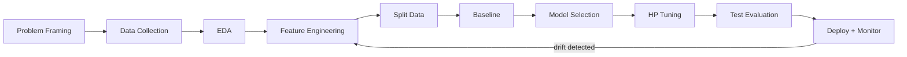

# 1. Core Concepts

> **Module goal:** Build an unshakable foundation. Every deep-learning, LLM, or agent question ultimately traces back to the ideas in this module. Master these 20 and you can reason through almost any ML problem.

---

## Q1. What is Machine Learning? Define it the way a staff engineer would. { #q1 }

**The crisp definition:** Machine Learning is the discipline of building systems that improve their performance on a task by learning patterns from data, rather than being explicitly programmed with rules.

**Three-part mental model — Arthur Samuel + Tom Mitchell framing:**

> A program is said to *learn* from **experience E** with respect to some class of **tasks T** and **performance measure P**, if its performance at tasks in T, as measured by P, improves with experience E.

**Example (spam filter):**

- **T** = classify emails as spam/not-spam
- **E** = a corpus of labeled emails
- **P** = accuracy on a held-out test set

**Rule-based vs ML — the contrast that sells it in an interview:**

```python
# Rule-based: rules hand-written, brittle
def is_spam_rules(email):
    if "viagra" in email.lower(): return True
    if "nigerian prince" in email.lower(): return True
    # ...hundreds of rules, still miss novel spam
    return False

# ML: patterns learned from data
from sklearn.linear_model import LogisticRegression
from sklearn.feature_extraction.text import TfidfVectorizer

vec = TfidfVectorizer()
X = vec.fit_transform(email_corpus)       # features FROM data
model = LogisticRegression().fit(X, y)    # patterns LEARNED
model.predict(vec.transform(new_emails))  # generalizes to unseen
```

!!! tip "Interviewer tip"
    Always mention **generalization** — ML's whole point is performing well on *unseen* data. A model that memorizes training data isn't learning; it's indexing.

---

## Q2. Supervised vs Unsupervised vs Reinforcement vs Semi-supervised vs Self-supervised Learning { #q2 }

| Paradigm | What it learns from | Goal | Flagship example |
|---|---|---|---|
| **Supervised** | Labeled `(X, y)` pairs | Map X → y for new X | Spam classification, house-price regression |
| **Unsupervised** | Unlabeled X only | Discover structure | Customer segmentation, anomaly detection |
| **Reinforcement** | Reward signal from environment | Learn a policy that maximizes long-term reward | Game AI (AlphaGo), robotics, RLHF in ChatGPT |
| **Semi-supervised** | Small labeled + large unlabeled | Use unlabeled data to improve supervised model | Medical imaging where labels are costly |
| **Self-supervised** | Unlabeled data, **labels derived from the data itself** | Learn representations | BERT (mask-and-predict), GPT (next-token), SimCLR |

**The analogies that stick:**

- **Supervised** — a student with an answer key.
- **Unsupervised** — a child sorting mixed toys into groups without guidance.
- **Reinforcement** — training a dog with treats and "no's."
- **Self-supervised** — reading a book with some words blacked out and guessing them; the book itself is the teacher.

**Why self-supervised is the hottest topic right now:** modern LLMs (GPT, LLaMA, Claude) are *pre-trained* self-supervised on the entire internet — no human labeled the data. This is how scale became possible.

<div class="scenario" markdown>
**You're building a fraud-detection system. You have millions of transactions but only a few hundred confirmed fraud cases. Which paradigm(s) would you combine?**

**Answer:** This is a classic semi-supervised problem. Use (1) unsupervised anomaly detection (Isolation Forest, autoencoder) to flag unusual transactions, (2) supervised on the few labels you have, (3) pseudo-label high-confidence unsupervised flags and feed them back. You can also layer active learning — send borderline cases to human reviewers and iteratively grow your label set.
</div>

---

## Q3. Classification vs Regression — When does the line blur? { #q3 }

**Classification** predicts a discrete category; **Regression** predicts a continuous number. Easy so far.

**The blur:**

1. **Ordinal regression** — predicting a ranked category (movie rating 1–5). It's classification in form but order matters, so MAE-style losses often beat cross-entropy.
2. **Binary classification via logistic regression** — the *model* outputs a continuous probability `p ∈ [0, 1]`, thresholded to 0/1. The regression-classification boundary is literally a threshold decision.
3. **Count regression** (Poisson regression) — predicting an integer like "number of website visits." Technically discrete, but treated as regression.

**Interview-grade test to pick the right framing:**

```
Is the output ordered?         → Regression or ordinal classification
Are the classes independent?   → Classification
Is the output unbounded?       → Regression
Can you threshold a probability → Binary classification (often preferred)
for your real answer?
```

<div class="tip-box" markdown>
"Predict next month's sales" looks like regression, but if the business only cares about "will we beat $1M?" — reframe as classification. **The model should match the decision, not the number.**
</div>

---

## Q4. Parametric vs Non-parametric Models { #q4 }

**Parametric** — model has a *fixed* number of parameters; complexity doesn't grow with data.

- Examples: linear regression, logistic regression, neural networks (with fixed architecture), naive Bayes.
- Pros: fast inference, small memory, strong priors.
- Cons: if your prior is wrong, you can't fix it by adding data.

**Non-parametric** — number of parameters (or storage) grows with the training data.

- Examples: k-NN (stores the entire training set), decision trees (grow splits until stopping criteria), kernel SVM, Gaussian Processes.
- Pros: flexible, makes fewer assumptions about the data shape.
- Cons: slow at inference (k-NN scans the whole set), memory grows.

!!! note "Common misconception"
    "Non-parametric" does not mean *no parameters*. It means the number isn't fixed up-front. A deep decision tree has **more** parameters than linear regression.

**Rule of thumb for interviews:** small data + clear structure → parametric. Big data + complex unknown structure → non-parametric or overparameterized neural nets.

---

## Q5. Discriminative vs Generative Models { #q5 }

**Discriminative** — learns `P(y | x)`: "given an email, probability it's spam."

- Examples: logistic regression, SVM, random forests, most neural nets for classification.
- Strength: typically more accurate when you only need to predict.

**Generative** — learns `P(x, y)` or `P(x | y)`: the joint/conditional distribution of the data.

- Examples: naive Bayes, GMMs, HMMs, variational autoencoders, GANs, diffusion models, GPT.
- Strength: can *generate* new samples. Can handle missing inputs.

**The modern twist — LLMs are generative:** GPT learns `P(next_token | previous_tokens)`, which is *why* it can write; a discriminative classifier can only label.

<div class="scenario" markdown>
**You have only 200 training examples. Which is likely to work better, logistic regression (discriminative) or naive Bayes (generative)?**

**Answer:** Naive Bayes, typically. Generative models converge to their asymptotic error with **less data** because they incorporate more structure (class priors + feature distributions). Discriminative models win asymptotically (with enough data) but lose in the low-data regime. This is the classic Ng & Jordan (2001) result — great to cite in interviews.
</div>

---

## Q6. Batch vs Online (Incremental) vs Mini-batch Learning { #q6 }

| Mode | Sees data how? | Good for | Example |
|---|---|---|---|
| **Batch** | All at once, multiple epochs | Stable datasets, offline training | `sklearn` `.fit()` |
| **Online** | One sample at a time, update immediately | Streaming data, non-stationary, low memory | `partial_fit()`, SGD, River |
| **Mini-batch** | Small chunks (32–1024) | Best of both — stable gradients + fits in GPU memory | Deep learning default |

**Why mini-batch won deep learning:** full-batch gradients are expensive and too smooth (can get stuck in saddle points); single-sample gradients are too noisy. Mini-batch hits the Goldilocks zone and fits GPU memory.

**Online learning shines when:** data distribution drifts (fraud, recommendations), memory is constrained (edge devices), or you need instant adaptation.

---

## Q7. Instance-based vs Model-based Learning { #q7 }

**Instance-based** (lazy): "memorize examples, compare new inputs to them."

- k-Nearest Neighbors is the canonical example. No training phase; all work at inference.
- Pro: zero training time, can adapt instantly to new data.
- Con: slow prediction, needs the whole dataset at serve time.

**Model-based** (eager): "build a compact representation; throw away the data."

- Linear regression, neural networks. Heavy training, fast inference.

!!! tip "Interview zinger"
    "k-NN has **zero training time and infinite prediction time**; linear regression is the opposite. Real systems live on the model-based side because inference latency matters more than training time."

---

## Q8. Training Set vs Validation Set vs Test Set — Why three? { #q8 }

- **Training set** — the model *learns* parameters from this.
- **Validation set** — you tune *hyperparameters* (learning rate, depth, regularization) on this.
- **Test set** — final, untouched estimate of generalization.

**Why you cannot merge validation into test:** the moment you pick a hyperparameter based on a set, the model has "seen" it through your decision-making. Reusing that set for final reporting overstates performance. This is a subtle form of **data leakage**.

**Typical splits:**

- Small data: 60/20/20
- Medium data: 70/15/15
- Very large data: 98/1/1 (1% of 10M is still 100k — plenty)

```python
from sklearn.model_selection import train_test_split

# Two-step split to get train/val/test
X_temp, X_test, y_temp, y_test = train_test_split(X, y, test_size=0.15, stratify=y, random_state=42)
X_train, X_val, y_train, y_val = train_test_split(X_temp, y_temp, test_size=0.176, stratify=y_temp, random_state=42)
# 0.176 of 0.85 ≈ 0.15 of total
```

<div class="scenario" markdown>
**Your test accuracy is 92% but production accuracy is 78%. What are the three most likely causes?**

**Answer:** (1) **Data leakage** — something in your pipeline (e.g. target-encoded feature computed on the whole set) leaked test info into training. (2) **Covariate shift** — production data distribution differs from your test set (older data, different geography, new feature values). (3) **Test-set contamination** — you iterated on test set during development, so hyperparameters are implicitly overfit to it. Ask *when* the test set was last frozen.
</div>

---

## Q9. The IID Assumption — and when it breaks { #q9 }

**IID** = Independent and Identically Distributed. Standard supervised learning assumes all samples are drawn independently from the same distribution.

**When it's broken (and what to do):**

| Violation | Example | Fix |
|---|---|---|
| **Non-stationary** (distribution shifts over time) | User behavior changes seasonally | Time-based splits, online learning, drift detection |
| **Non-independent** (samples correlated) | Multiple rows per user, time series | Group k-fold, time-series CV, don't split within a group |
| **Selection bias** | Labeled samples aren't representative | Reweighting, domain adaptation |
| **Label shift** | Class priors differ train vs test | Recalibrate with known test priors |

**The most common junior mistake:** random-splitting a time series. You end up predicting the past from the future. Always use `TimeSeriesSplit` for temporal data.

---

## Q10. Inductive Bias — Why every model needs one { #q10 }

**Inductive bias** is the set of assumptions a model uses to generalize from finite data to unseen cases. *Without* inductive bias, a model cannot generalize.

**Examples of inductive biases by model:**

- **Linear regression:** "The relationship between X and y is linear."
- **Decision trees:** "The target is a piecewise-constant function of axis-aligned splits."
- **CNNs:** "Features are local, translation-invariant, and hierarchical."
- **Transformers:** much weaker than CNNs — "tokens interact via attention; order matters only through positional encoding." This weak prior is why transformers need so much data but also why they scale so well.

**Interview-grade insight:** the right inductive bias is the biggest free lunch in ML. Use CNNs for images, RNNs/transformers for sequences, GNNs for graphs — because you're giving the model a huge head start.

---

## Q11. No-Free-Lunch Theorem — and why practitioners still have favorites { #q11 }

**The theorem (informally):** averaged over *all possible problems*, no learning algorithm is better than any other — including random guessing.

**Why it doesn't ruin ML:** we don't care about "all possible problems." We care about real-world data, which has structure (smoothness, locality, sparsity). Algorithms that exploit that structure beat others.

**Interview takeaway:** when asked "what's the best ML algorithm?" the correct answer is "it depends on the inductive bias that matches your problem's structure." Then name which models match which structures.

---

## Q12. The Curse of Dimensionality { #q12 }

As dimensionality grows, intuitions from 2D/3D break down:

1. **Distance concentration** — in high dimensions, all points become roughly equidistant. k-NN and anything relying on distance degrades.
2. **Data sparsity** — the volume grows exponentially. You need exponentially more data to cover the space at the same density.
3. **Overfitting risk** — more features mean more ways to fit noise.

**Demo intuition:**

```python
import numpy as np
for d in [2, 10, 100, 1000]:
    X = np.random.randn(1000, d)
    dists = np.linalg.norm(X[0] - X[1:], axis=1)
    print(f"d={d:5d}: min/max ratio = {dists.min()/dists.max():.3f}")
# ratio approaches 1.0 → all points equidistant
```

**Mitigations:**
- Dimensionality reduction (PCA, UMAP, autoencoders)
- Feature selection
- Regularization (L1 zeros out irrelevant features)
- Distance metrics robust to dimensionality (cosine for text)

---

## Q13. Occam's Razor in ML — and when it's wrong { #q13 }

**Classical view:** among competing models with similar training error, prefer the simpler one — it will generalize better.

**The modern wrinkle (double-descent):** with highly overparameterized models (modern deep nets, LLMs), adding *more* parameters beyond the interpolation threshold sometimes *improves* test error, contradicting the U-shaped bias-variance intuition. Current best explanation: implicit regularization from SGD + huge hypothesis spaces smoothing things out.

**Practical takeaway:** start simple (baseline with linear/logistic regression). If a complex model doesn't beat it by a meaningful margin, stick with simple — simpler models are faster, cheaper, and easier to debug.

---

## Q14. What is a Loss Function? Why these specific ones? { #q14 }

A loss function measures how wrong the model's predictions are. Training = minimizing loss.

**Regression:**

| Loss | Formula | When |
|---|---|---|
| MSE | `(y - ŷ)²` | Default; penalizes large errors quadratically |
| MAE | `|y - ŷ|` | Robust to outliers |
| Huber | quadratic for small errors, linear for large | Best of both worlds |

**Classification:**

| Loss | Formula (binary) | Intuition |
|---|---|---|
| Cross-entropy / log-loss | `−[y log(ŷ) + (1−y) log(1−ŷ)]` | Penalizes confident wrong predictions heavily |
| Hinge loss | `max(0, 1 − y·ŷ)` | SVM — only cares about the margin |
| Focal loss | `(1−ŷ)^γ · log(ŷ)` | Down-weights easy examples; helps class imbalance |

**Why MSE is wrong for classification:**

- Squared error penalizes predictions that are "too confident correct" the same way as "slightly wrong," which doesn't match the true goal.
- Log-loss has the right gradient shape for probabilistic outputs.

---

## Q15. Parameters vs Hyperparameters { #q15 }

- **Parameters** — learned from data during training. Weights in a neural network, coefficients in linear regression, split thresholds in a tree.
- **Hyperparameters** — set *before* training. Learning rate, number of trees, depth, regularization strength, batch size, number of layers.

**How to tune hyperparameters:**

1. **Grid search** — exhaustive, expensive. Fine for ≤3 hyperparameters.
2. **Random search** — beats grid in high dimensions (Bergstra & Bengio 2012).
3. **Bayesian optimization** (`optuna`, `hyperopt`) — models the hyperparameter landscape.
4. **Hyperband / BOHB** — adaptive early stopping for cheap hyperparameters.

```python
import optuna

def objective(trial):
    lr = trial.suggest_float("lr", 1e-5, 1e-1, log=True)
    depth = trial.suggest_int("depth", 3, 15)
    model = RandomForestClassifier(max_depth=depth).fit(X_train, y_train)
    return model.score(X_val, y_val)

study = optuna.create_study(direction="maximize")
study.optimize(objective, n_trials=50)
print(study.best_params)
```

---

## Q16. Feature, Label, Instance, Target — terminology cleanup { #q16 }

| Term | Meaning | Other names |
|---|---|---|
| **Feature / input / predictor / covariate / independent variable** | A column in X | X, x, attribute |
| **Label / target / output / dependent variable / ground truth** | What you're predicting | y |
| **Instance / sample / example / observation / row** | One data point | record |
| **Batch** | Group of instances processed together | mini-batch |

Knowing this vocabulary lets you read any ML paper or API doc without friction.

---

## Q17. Model Capacity, Complexity, and Expressiveness { #q17 }

**Capacity** — the size of the hypothesis space a model can represent. A deeper tree has higher capacity than a shallow one. A 1B-parameter network has more capacity than a 1M-parameter one.

**Too little capacity → underfitting** (high bias). Too much → overfitting (high variance), *unless* you regularize heavily or have enormous data.

**Measuring capacity:**
- **VC dimension** — classical theoretical measure (rarely used in practice).
- **Number of parameters** — crude but practical.
- **Effective capacity** — what the optimizer can actually reach given finite compute.

**Modern insight:** overparameterized deep nets have massive capacity but implicit regularization from SGD + early stopping + data augmentation keeps generalization strong.

---

## Q18. What is the Learning Rate — and why it's the most important hyperparameter { #q18 }

The **learning rate (η)** controls how big a step the optimizer takes in the direction of the negative gradient.

```
θ_new = θ_old − η · ∇L(θ_old)
```

- **Too high** → bounces around, may diverge (loss explodes to NaN).
- **Too low** → crawls, never converges in reasonable time; can get stuck in bad local optima.

**Diagnostic signals:**

| Loss curve shape | Diagnosis |
|---|---|
| Oscillates wildly, sometimes increases | LR too high |
| Decreases very slowly | LR too low |
| Decreases then plateaus | Consider LR schedule |
| Decreases, then explodes | LR way too high; or exploding gradients |

**Practical defaults:**
- Adam with LR `1e-3` for most deep learning.
- SGD + momentum with LR `1e-2` for vision.
- AdamW with LR `1e-4` to `5e-5` for transformer fine-tuning.

**LR schedules:**
- **Step decay** — drop by 10× every N epochs.
- **Cosine annealing** — smooth decay; very popular in modern training.
- **Warmup** — start tiny, ramp up over first N steps. Critical for transformers.
- **One-cycle** (Leslie Smith) — up then down; often beats fixed LR dramatically.

---

## Q19. Convergence — How do you know a model has converged? { #q19 }

**Definition:** the loss (or validation metric) has plateaued and further training doesn't improve it.

**Signals of healthy convergence:**
1. Training loss decreases monotonically (mostly).
2. Validation loss decreases alongside — then flattens.
3. Gradient magnitudes shrink toward zero.

**Signals of problems:**
- **Not converging** — loss fluctuates or rises. Check LR, data quality, loss scaling.
- **Converging to bad solution** — loss low but metric bad. Check label quality, loss function, class imbalance.
- **Converged prematurely (underfit)** — low capacity or too-aggressive regularization.
- **Overfitting** — training loss keeps dropping but validation loss climbs. Classic divergence point.

**Early stopping** is the canonical defense: monitor validation loss, halt when it hasn't improved for *patience* epochs.

---

## Q20. The Complete ML Pipeline — the mental checklist every engineer needs { #q20 }

When an interviewer says "design an ML system for X," walk through these 10 stages:

1. **Problem framing** — classification? regression? ranking? What's the business metric?
2. **Data collection** — where from? how much? how often refreshed?
3. **Exploratory data analysis** — distributions, missingness, outliers, target imbalance.
4. **Feature engineering** — transformations, interactions, encoding, scaling.
5. **Train/val/test split** — time-aware if temporal, stratified if imbalanced.
6. **Baseline model** — simplest thing that works (majority class, linear model).
7. **Model selection** — iteratively try candidates; compare on validation.
8. **Hyperparameter tuning** — Optuna/Hyperopt, never manual.
9. **Final evaluation on test set** — once. Never twice.
10. **Deployment + monitoring** — latency, drift, performance, feedback loop.



!!! tip "The interviewer signal"
    When asked to design an ML system, **always start with "what's the business metric?"**. 90% of candidates jump to XGBoost. The 10% who ground the problem in business value get the offer.

---

**Module complete.** Next → [2. Data & Features →](data-and-features.md)
