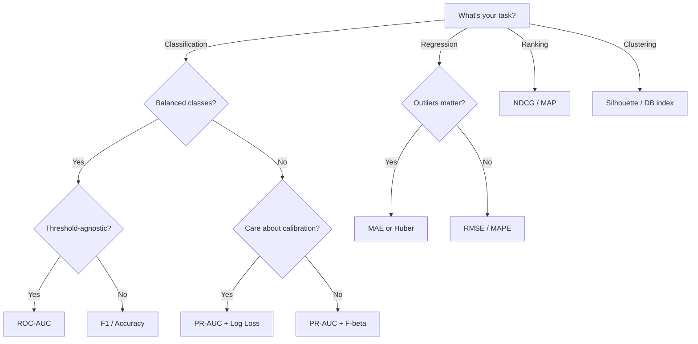

# 5. Evaluation Metrics

> **Module goal:** The difference between a good engineer and a great one is which metric they choose. This module covers every metric you will be asked about — with the scenarios that reveal when each is right or wrong.

---

## Q71. The confusion matrix — the source of everything { #q71 }

For binary classification:

|                  | Predicted Positive | Predicted Negative |
|------------------|-------------------|-------------------|
| **Actual Positive** | True Positive (TP) | False Negative (FN) |
| **Actual Negative** | False Positive (FP) | True Negative (TN) |

From this, everything derives:

$$
\text{Accuracy} = \frac{TP + TN}{TP + TN + FP + FN}
$$

$$
\text{Precision} = \frac{TP}{TP + FP} \quad
\text{Recall} = \frac{TP}{TP + FN} \quad
\text{Specificity} = \frac{TN}{TN + FP}
$$

$$
F_1 = 2 \cdot \frac{\text{Precision} \cdot \text{Recall}}{\text{Precision} + \text{Recall}}
$$

```python
from sklearn.metrics import confusion_matrix, classification_report
print(confusion_matrix(y_true, y_pred))
print(classification_report(y_true, y_pred, digits=3))
```

---

## Q72. Accuracy — when it's misleading { #q72 }

Accuracy is the fraction of correct predictions. Simple, intuitive, and often wrong.

**When accuracy fails:**

1. **Class imbalance** — 99% non-fraud, 1% fraud. A model predicting "never fraud" gets 99%. Useless.
2. **Asymmetric costs** — missing a cancer diagnosis ≠ false alarm. Equal weighting in accuracy hides this.
3. **Ordinal targets** — predicting "severe" when true is "mild" is worse than predicting "moderate." Accuracy treats both as "wrong."
4. **Ranked outputs** — accuracy doesn't measure ranking quality.

**Use accuracy when:** classes are roughly balanced, costs are roughly equal, and you care about "how often right."

---

## Q73. Precision vs Recall — when each matters { #q73 }

**Precision** answers: "Of everything I flagged as positive, how much was actually positive?"

**Recall** (a.k.a. sensitivity, true positive rate) answers: "Of all actual positives, how many did I catch?"

**The tradeoff:** they usually move in opposite directions as you shift the threshold. Lowering threshold → catch more (higher recall) → but more false alarms (lower precision).

| Scenario | What to optimize |
|---|---|
| **Cancer screening** | Recall — can't miss a real case |
| **Spam filter** | Precision — marking real mail as spam is costly |
| **Search results** | Precision@k — first page matters |
| **Fraud detection** | Recall with a precision floor |
| **Criminal trial (analogy)** | Precision — "innocent until proven guilty" |
| **Public health outbreak** | Recall — must detect every case |

---

## Q74. F1, F-beta — what if you need both? { #q74 }

**F1** is the harmonic mean of precision and recall. Why harmonic? Because it punishes imbalance — if either P or R is near zero, F1 drops sharply.

**F-beta** weights recall β times more than precision:

$$
F_\beta = (1 + \beta^2) \cdot \frac{P \cdot R}{\beta^2 \cdot P + R}
$$

- β = 1 → F1.
- β = 2 → recall twice as important (medical screening).
- β = 0.5 → precision twice as important (spam).

**When F1 is *wrong*:** when true-negative behavior also matters. F1 ignores TN. A model that always says "positive" can still have decent F1 on imbalanced data.

---

## Q75. ROC-AUC — what it measures and what it doesn't { #q75 }

**ROC curve:** plot TPR (recall) vs FPR across all thresholds.

**AUC:** area under that curve. Interpretable as: *probability that the model ranks a randomly chosen positive above a randomly chosen negative*.

- AUC = 0.5 → no better than random.
- AUC = 1.0 → perfect separation.

**When ROC-AUC is the right metric:**
- Threshold-agnostic comparison.
- Roughly balanced classes.
- Ranking quality matters.

**When ROC-AUC misleads:**

1. **Extreme class imbalance** — AUC can be high (e.g., 0.95) while the model is still useless at operating thresholds (e.g., only 5% precision at your needed recall). Use **PR-AUC** instead.
2. **Different score scales** — AUC is invariant to monotonic transforms, so it doesn't reflect calibration.

```python
from sklearn.metrics import roc_auc_score, average_precision_score
print("ROC-AUC:", roc_auc_score(y_val, probs))
print("PR-AUC:",  average_precision_score(y_val, probs))
```

---

## Q76. PR-AUC (Average Precision) — the imbalanced-data hero { #q76 }

Precision-Recall curve plots precision vs recall across thresholds. The area under it is **Average Precision (AP)**.

**Why PR-AUC beats ROC-AUC for imbalanced problems:** ROC-AUC includes TN in its FPR denominator, so high-volume negatives dominate. PR-AUC focuses entirely on positive predictions, where you actually care.

**Interview-ready rule:**
- Balanced classes → ROC-AUC.
- Imbalanced classes → PR-AUC.
- Both reported → shows you know.

---

## Q77. Log loss (cross-entropy) — the probability-aware metric { #q77 }

$$
\text{Log loss} = -\frac{1}{N}\sum_i \left[ y_i \log(p_i) + (1-y_i) \log(1-p_i) \right]
$$

- Rewards probabilistic confidence that matches truth.
- A perfectly confident wrong prediction (`p=0` when `y=1`) gives infinite loss.
- Lower is better; 0 is perfect.

**Use log loss when:** you care about calibrated probabilities, not just ranking or classification. Downstream systems consume the probabilities.

---

## Q78. Threshold tuning — the step most engineers skip { #q78 }

The default threshold 0.5 is almost never optimal. Tune based on your business metric.

```python
from sklearn.metrics import precision_recall_curve
import numpy as np

probs = model.predict_proba(X_val)[:, 1]
p, r, t = precision_recall_curve(y_val, probs)
f1 = 2 * p * r / (p + r + 1e-9)
best_t = t[np.argmax(f1[:-1])]
print(f"Best threshold: {best_t:.3f}")

# Or, business-driven: maximize recall at precision ≥ 90%
idx = np.where(p[:-1] >= 0.9)[0]
best_t = t[idx[np.argmax(r[idx])]]
```

**The real question to ask the business:** "What's the cost of a false positive vs a false negative?" That ratio determines the threshold.

---

## Q79. Regression metrics — MSE, RMSE, MAE, MAPE, R² { #q79 }

| Metric | Formula | Property |
|---|---|---|
| **MSE** | `(1/n) Σ (y − ŷ)²` | Penalizes large errors quadratically |
| **RMSE** | `√MSE` | Same units as target; interpretable |
| **MAE** | `(1/n) Σ |y − ŷ|` | Robust to outliers |
| **MAPE** | `(1/n) Σ |y − ŷ| / |y|` | Scale-free, but breaks at y≈0 |
| **sMAPE** | symmetric MAPE | Bounded [0, 2]; handles y≈0 |
| **R²** | `1 − SS_res / SS_tot` | Fraction of variance explained |
| **Adj. R²** | adjusts for # features | Don't reward adding noise features |
| **Huber** | quadratic small, linear large | Outlier-robust hybrid |

**MSE vs MAE rule of thumb:**
- Outliers rare and you care about big errors → MSE.
- Outliers present or you care equally about all errors → MAE.

**R² interpretation nuances:**
- R² > 0 doesn't mean "good" — depends on problem.
- R² can be negative (model worse than predicting mean).
- Adjusted R² penalizes adding features that don't help.

---

## Q80. The silhouette score (clustering) { #q80 }

For unsupervised clustering, silhouette measures how well-separated clusters are:

$$
s_i = \frac{b_i - a_i}{\max(a_i, b_i)}
$$

- `a_i` = avg distance from sample i to other points in *same* cluster.
- `b_i` = avg distance from sample i to points in *nearest other* cluster.
- Range: [−1, +1]. Higher is better. <0 means point likely in wrong cluster.

**Used for:** picking k in k-means, validating cluster quality.

```python
from sklearn.metrics import silhouette_score
for k in range(2, 10):
    labels = KMeans(n_clusters=k, random_state=42).fit_predict(X)
    print(f"k={k}: silhouette={silhouette_score(X, labels):.3f}")
```

---

## Q81. NDCG, MAP — ranking metrics { #q81 }

**NDCG (Normalized Discounted Cumulative Gain):** for ranked results, rewards placing relevant items near the top. Discounts relevance by log(rank).

$$
DCG_k = \sum_{i=1}^{k} \frac{rel_i}{\log_2(i+1)} \quad NDCG_k = \frac{DCG_k}{IDCG_k}
$$

**MAP (Mean Average Precision):** average of precision at each relevant document's position, averaged over queries.

**When used:**
- Search engines — NDCG@10.
- Recommendation systems — MAP or NDCG@k.
- Information retrieval.

---

## Q82. Cohen's Kappa — agreement beyond chance { #q82 }

$$
\kappa = \frac{p_o - p_e}{1 - p_e}
$$

- `p_o` = observed agreement.
- `p_e` = agreement expected by chance.

**Interpretation:**
- κ = 1 → perfect agreement.
- κ = 0 → no better than chance.
- κ < 0 → worse than chance.

**Used for:** annotator agreement, classification on imbalanced data (more honest than accuracy).

---

## Q83. Matthews Correlation Coefficient (MCC) { #q83 }

$$
MCC = \frac{TP \cdot TN - FP \cdot FN}{\sqrt{(TP+FP)(TP+FN)(TN+FP)(TN+FN)}}
$$

- Range: [−1, +1].
- Balances TP, TN, FP, FN — honest on imbalanced data.
- Often cited as the single best binary classification metric when you must pick one.

---

## Q84. Multi-class classification — macro vs micro vs weighted { #q84 }

When you have multi-class and need a single P/R/F1:

- **Macro average** — compute metric per class, unweighted average. All classes equal.
- **Micro average** — aggregate TP/FP/FN across classes first, then compute. Dominated by frequent classes.
- **Weighted average** — per-class, weighted by support (true instances).

**When to use which:**
- Macro → you care equally about all classes (rare diseases must matter).
- Weighted → you care about overall accuracy on your distribution.
- Micro → gives same as accuracy for single-label classification.

```python
from sklearn.metrics import f1_score
f1_score(y_true, y_pred, average='macro')     # per-class equal
f1_score(y_true, y_pred, average='weighted')  # frequency-weighted
f1_score(y_true, y_pred, average='micro')     # aggregate first
```

---

## Q85. Offline vs online metrics — the gap { #q85 }

**Offline metrics** (computed on historical data):
- Accuracy, AUC, RMSE — what you compute during dev.
- Problem: don't capture actual user behavior.

**Online metrics** (computed on live traffic):
- CTR, conversion rate, revenue per user, session duration.
- Problem: slow to measure, noisy, affected by many factors.

**The classic gap:** your model improves offline AUC by 2%. You deploy. Online CTR doesn't move. Why?

1. **Selection bias** — offline data reflects the *old* model's behavior; you're training on data it helped shape.
2. **Feedback loops** — new recommendations → new user behavior → new data distribution.
3. **Misaligned metrics** — AUC optimizes ranking; users click based on other factors.

**The cure:** A/B test with live traffic before drawing conclusions. Never ship on offline metrics alone.

---

## Q86. A/B testing 101 — the ML engineer's version { #q86 }

**Setup:**
1. Define primary metric (e.g., CTR) upfront.
2. Compute required sample size for detectable effect.
3. Randomly split users (not requests — same user should stay in one group).
4. Run long enough to capture weekly seasonality.
5. Pre-register secondary metrics and guardrails.

**Statistical test:**
- Continuous metric → t-test or Mann-Whitney.
- Binary metric → chi-squared or z-test of proportions.
- Multiple comparisons → Bonferroni correction or BH-FDR.

**Common pitfalls:**
- **Peeking** — stopping early when you see significance. Inflates false positives. Use sequential tests if needed.
- **Simpson's paradox** — effect reverses across subgroups.
- **Novelty effect** — users react to change, not the quality.
- **Primary metric misalignment** — driving CTR by showing clickbait hurts long-term retention.

---

## Q87. Statistical significance — p-values and confidence intervals { #q87 }

**p-value** — probability of observing data this extreme (or more) if the null hypothesis (no difference) is true.

- p < 0.05 → "statistically significant" (by convention).
- NOT "probability the result is real."
- NOT "probability the null is true."

**Confidence interval** is often more useful: "the effect size is 2.3% ± 0.4% with 95% confidence." Conveys magnitude and uncertainty.

**Practical tips:**
- Report effect size AND p-value.
- With large samples, tiny meaningless differences become "significant." Always ask: is it *practically* significant?

---

## Q88. Business metric vs ML metric alignment { #q88 }

**The gap:** an ML metric (F1, AUC) measures model behavior; a business metric (revenue, retention) measures value.

**Examples of misalignment:**

- **Churn prediction** — maximizing AUC means little if you can't act on the probabilities. Maximize *expected retention uplift given intervention cost*.
- **Recommendation** — NDCG doesn't measure purchase; it measures click ranking. Optimize for GMV or LTV.
- **Fraud** — F1 balances P and R equally; your business might need 90%+ recall with whatever precision you can get.

**The fix:** define the *business objective* first. Then pick the ML metric closest to it. Then run A/B tests on the business metric.

---

## Q89. Calibration as a separate dimension { #q89 }

A model can have high AUC but be miscalibrated — predicts "80% probability" when the true rate is 50%.

- AUC measures **ranking** — does the model sort correctly?
- Calibration measures **magnitude** — are the probabilities right?

A miscalibrated model breaks any downstream system that consumes probabilities for decision-making: risk-based pricing, triage queues, expected-value calculations.

**Fixing calibration:**
- Platt scaling — fit sigmoid on model outputs.
- Isotonic regression — non-parametric, flexible but needs more data.
- Temperature scaling — single-parameter scaling for NN logits.

---

## Q90. How to pick a metric — decision tree { #q90 }



!!! tip "The interview-safe answer"
    When asked "which metric would you use?", always say: **"I'd pick the metric that matches the business cost structure — then report multiple complementary metrics."** That's the senior-engineer move.

---

**Module complete.** Next → [6. Advanced Topics & Scenarios →](advanced-scenarios.md)
